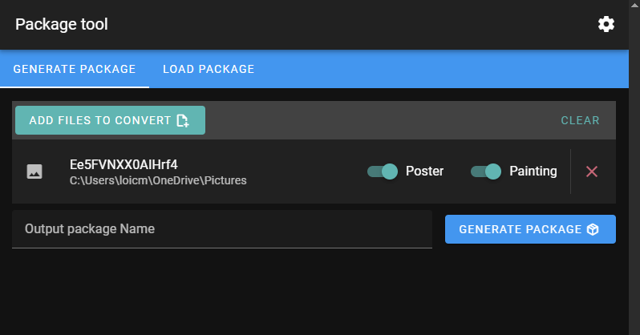
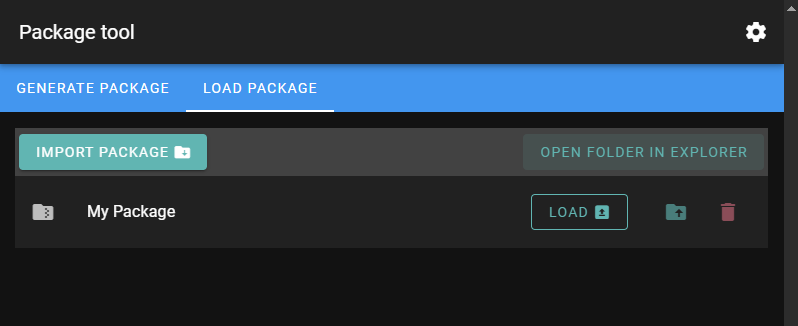

# LPG-UI
[](https://github.com/tauri-apps)
[](https://github.com/vuejs/)
[](https://github.com/vuetifyjs)

LPG-UI is a UI built over the [LPG crop tool](https://github.com/Atakku/lpg) by [femboy.tv](https://femboy.tv/). This is used to generate pictures formatted for [Lethal Posters](https://thunderstore.io/c/lethal-company/p/femboytv/LethalPosters/) and [Lethal Paintings](https://thunderstore.io/c/lethal-company/p/femboytv/LethalPaintings/).

## Setting up
> [!NOTE]
> This project uses [Deno](https://deno.com/). To use another runner, please update [Tauri config](src-tauri/tauri.conf.json)

1. Install [Tauri](https://tauri.app/) ![officially maintained]
2. Clone the project
3. Install dependencies:
```shell
  deno install
```
4. Run the dev task
```shell
  deno task tauri dev
```

## Available deno tasks
- `tauri dev`
- `tauri build`

## How to use the tool
### Generate a package

1. Ensure that the `Exported zip path` is set in the settings
2. Choose the pictures you want to use by clicking `Add files to convert`
3. For each file, you can choose whether you want is a poster, a painting or both
4. Choose a name for the package
5. Click `Generate package`
6. The generated package should be present in the `Exported zip path`

### Use a package

> [!NOTE]
> Loading a package will replace any existing images used for both [Lethal Posters](https://thunderstore.io/c/lethal-company/p/femboytv/LethalPosters/) and [Lethal Paintings](https://thunderstore.io/c/lethal-company/p/femboytv/LethalPaintings/)
- Install package locally
   1. Ensure that the `Mod tool folder path` is set in the settings
   2. Click `Load` on the package of you choice to install it locally.
- Export a package for your friends
   1. Clicking the export icon
   2. Your friend can import the package on his side by clicking `Import package`

## License
[](LICENSE.md)